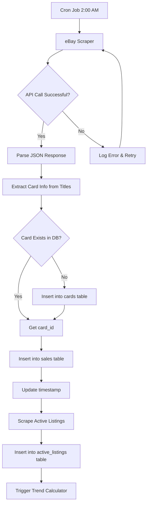
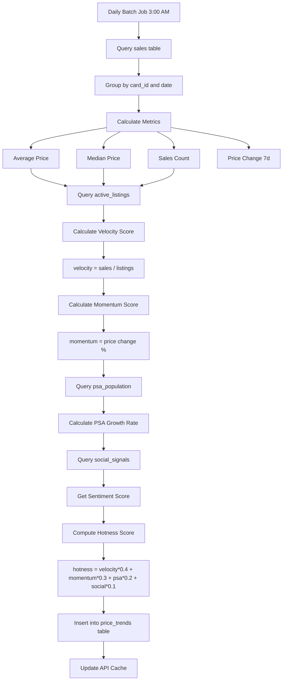
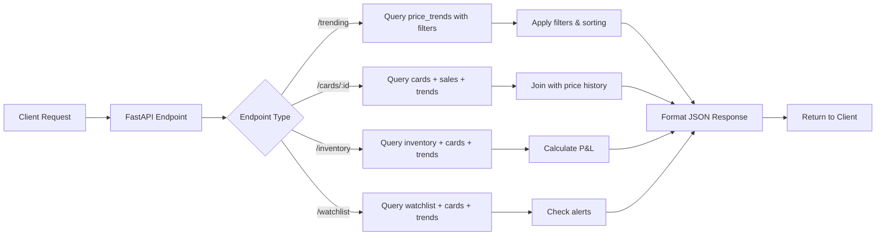
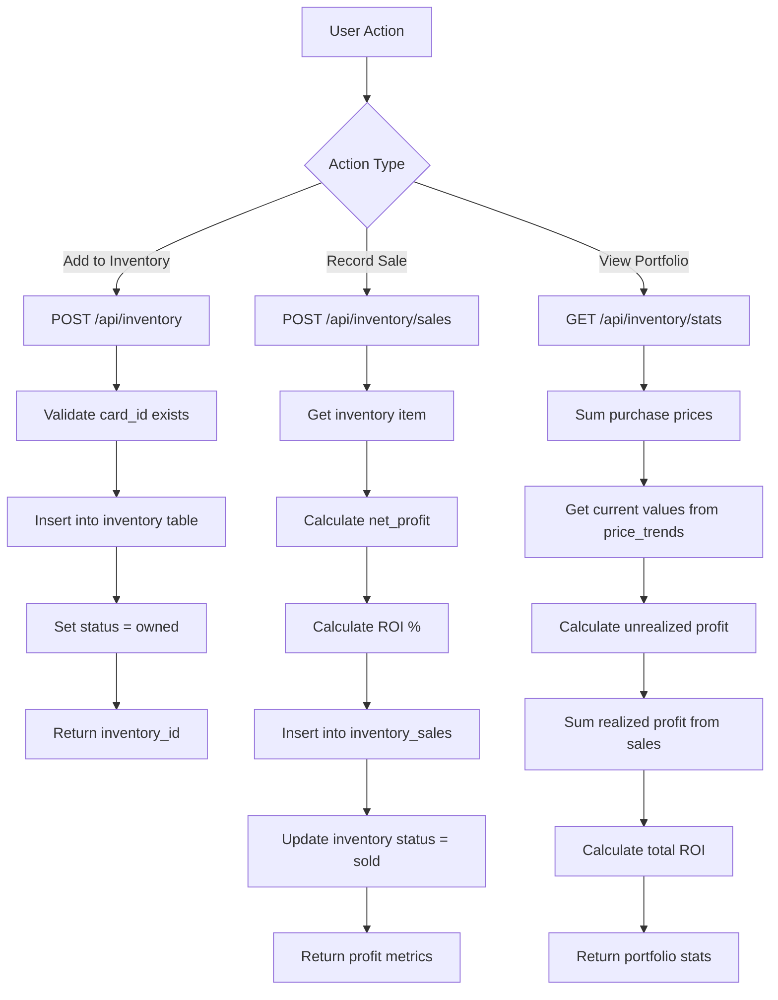
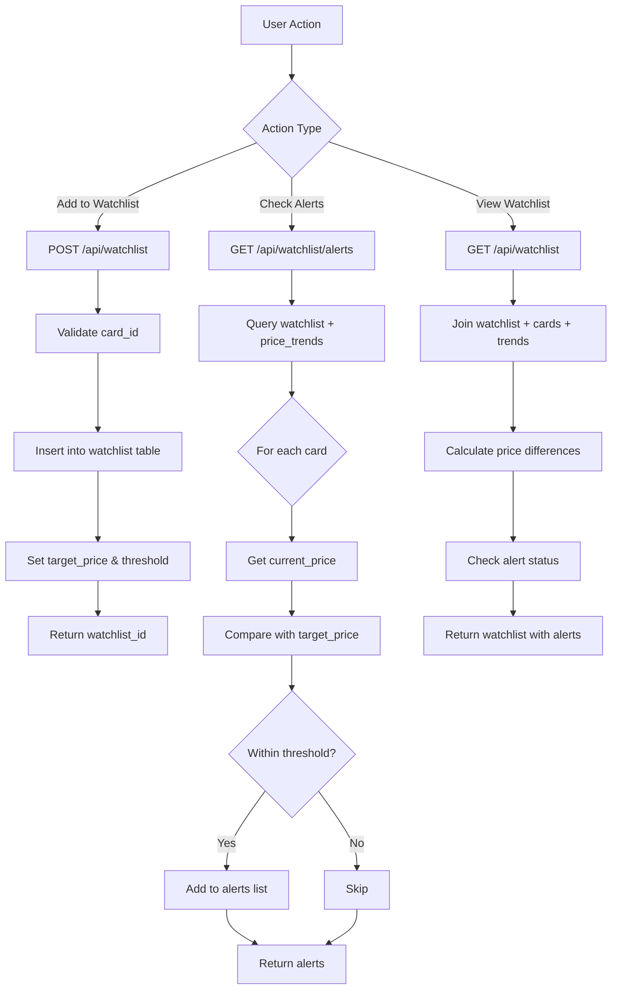
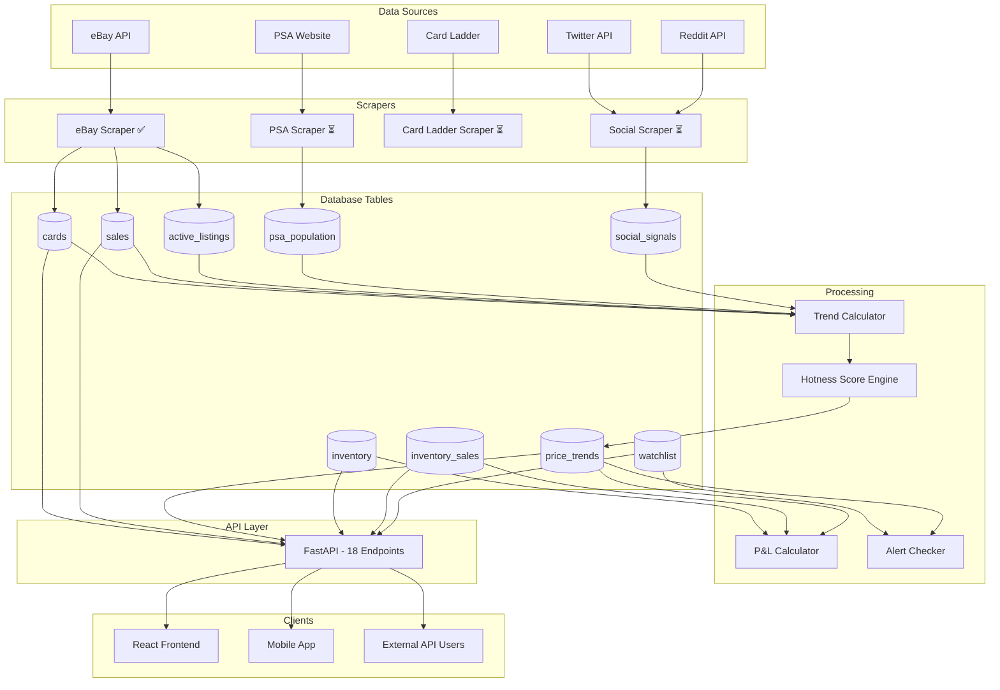
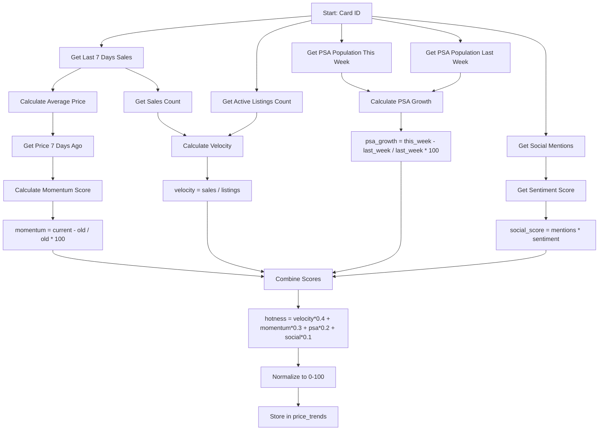
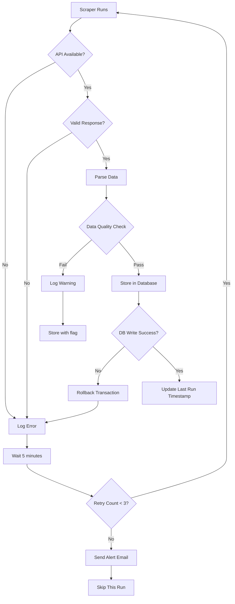

# Data Flow Diagrams

## Overview

This document contains data flow diagrams showing how data moves through the Trading Card Platform.

## 1. Nightly Scraping Pipeline

## 2. Trend Detection Flow

## 3. API Request Flow

## 4. Inventory Management Flow

## 5. Watchlist & Alert Flow

## 6. Complete Data Pipeline

## 7. Hotness Score Calculation Detail

## 8. Error Handling Flow

## Timing Schedule

| Job | Frequency | Duration | Dependencies |
|-----|-----------|----------|--------------|
| eBay Sold Scraper | Daily 2:00 AM | ~15 min | None |
| eBay Active Scraper | Daily 2:30 AM | ~10 min | None |
| Trend Calculator | Daily 3:00 AM | ~20 min | Sales + Listings data |
| Report Generator | Daily 3:30 AM | ~5 min | Trend Calculator |
| PSA Scraper | Weekly Sunday 1:00 AM | ~30 min | None |
| Social Scraper | Every 4 hours | ~5 min | None |
| Alert Checker | Hourly | ~2 min | Watchlist + Trends |

## Data Retention

| Table | Retention | Archive Strategy |
|-------|-----------|------------------|
| sales | 2 years | Move to sales_archive after 2 years |
| active_listings | 90 days | Delete after 90 days |
| price_trends | Indefinite | Keep all historical trends |
| inventory | Indefinite | Keep all records |
| inventory_sales | Indefinite | Keep all sales history |
| watchlist | Indefinite | User-managed |
| psa_population | Indefinite | Keep all snapshots |
| social_signals | 6 months | Aggregate and delete raw data |

## Version

**Last Updated:** 2025-02-11  
**Diagram Version:** 2.0.0  
**Status:** ✅ Current
